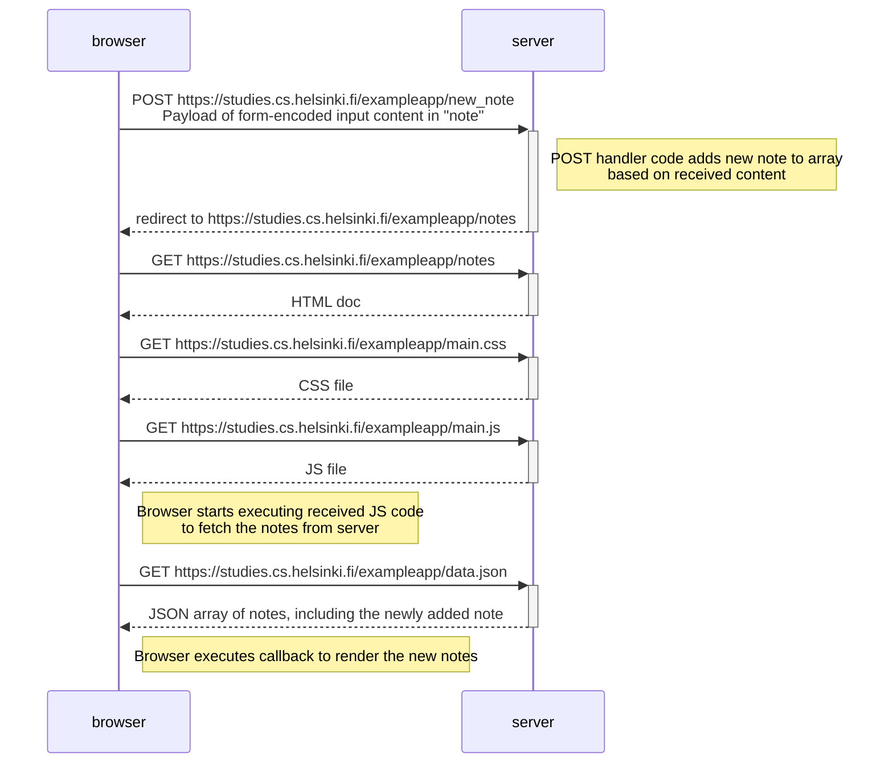

What happens when a new note is submitted via the form at https://studies.cs.helsinki.fi/exampleapp/notes:

```mermaid
sequenceDiagram
  participant B as browser
  participant S as server

  B->>+S: POST https://studies.cs.helsinki.fi/exampleapp/new_note<br>Payload of form-encoded input content in "note"
  Note right of S: POST handler code adds new note to array<br>based on received content
  S-->>-B: redirect to https://studies.cs.helsinki.fi/exampleapp/notes

  B->>+S: GET https://studies.cs.helsinki.fi/exampleapp/notes
  S-->>-B: HTML doc

  B->>+S: GET https://studies.cs.helsinki.fi/exampleapp/main.css
  S-->>-B: CSS file

  B->>+S: GET https://studies.cs.helsinki.fi/exampleapp/main.js
  S-->>-B: JS file
  Note right of B: Browser starts executing received JS code<br>to fetch the notes from server

  B->>+S: GET https://studies.cs.helsinki.fi/exampleapp/data.json
  S-->>-B: JSON array of notes, including the newly added note
  Note right of B: Browser executes callback to render the new notes
```
