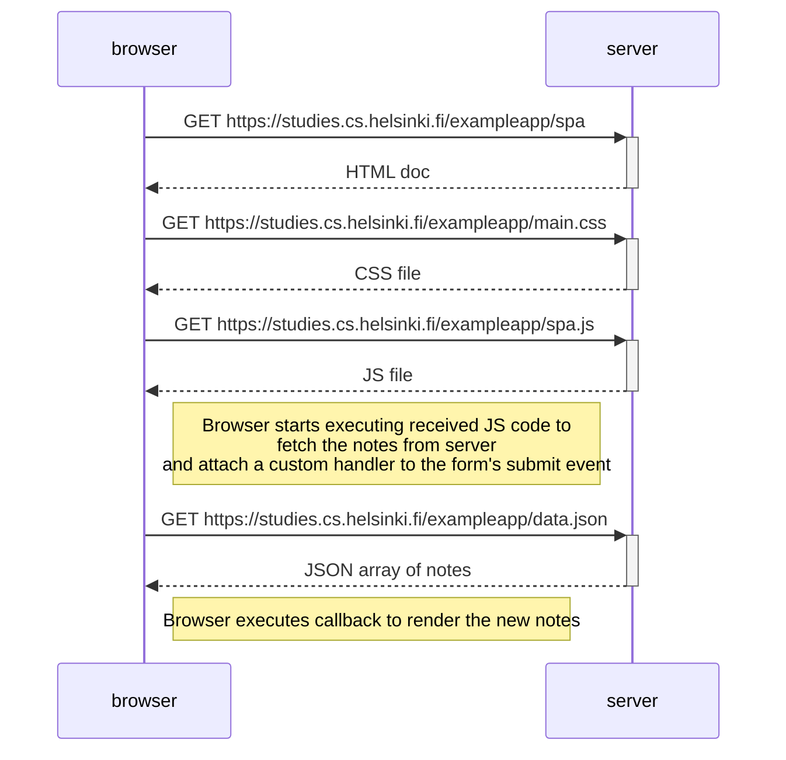

What happens when browser accesses the single-page app at https://studies.cs.helsinki.fi/exampleapp/spa:

```mermaid
sequenceDiagram
  participant B as browser
  participant S as server

  B->>+S: GET https://studies.cs.helsinki.fi/exampleapp/spa
  S-->>-B: HTML doc

  B->>+S: GET https://studies.cs.helsinki.fi/exampleapp/main.css
  S-->>-B: CSS file

  B->>+S: GET https://studies.cs.helsinki.fi/exampleapp/spa.js
  S-->>-B: JS file
  Note right of B: Browser starts executing received JS code to<br>fetch the notes from server<br>and attach a custom handler to the form's submit event

  B->>+S: GET https://studies.cs.helsinki.fi/exampleapp/data.json
  S-->>-B: JSON array of notes
  Note right of B: Browser executes callback to render the new notes
```
