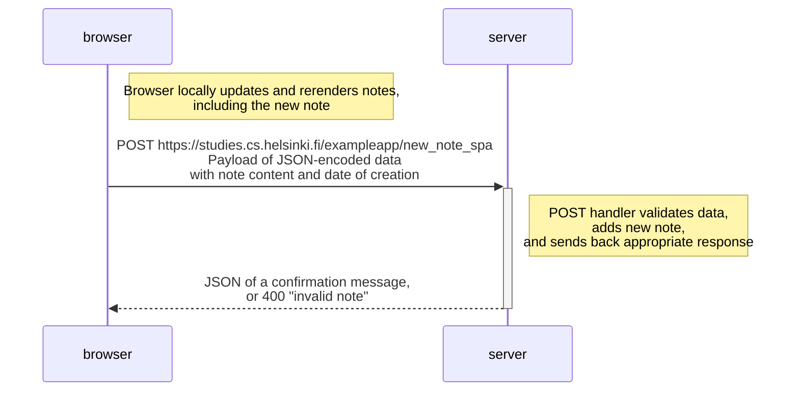

What happens when a new note is submitted at https://studies.cs.helsinki.fi/exampleapp/spa:

```mermaid
sequenceDiagram
  participant B as browser
  participant S as server

  Note right of B: Browser locally updates and rerenders notes,<br>including the new note
  B->>+S: POST https://studies.cs.helsinki.fi/exampleapp/new_note_spa<br>Payload of JSON-encoded data<br>with note content and date of creation
  Note right of S: POST handler validates data,<br>adds new note,<br>and sends back appropriate response
  S-->>-B: JSON of a confirmation message,<br>or 400 "invalid note"
```
